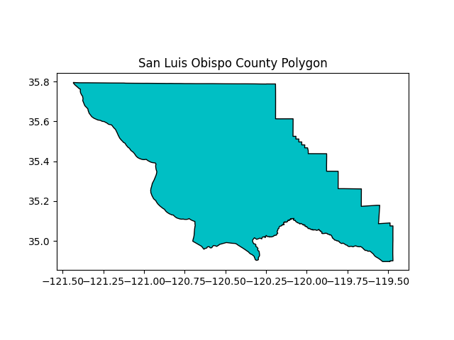
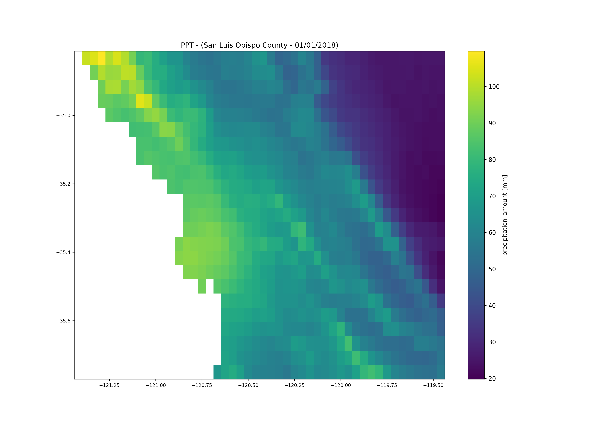
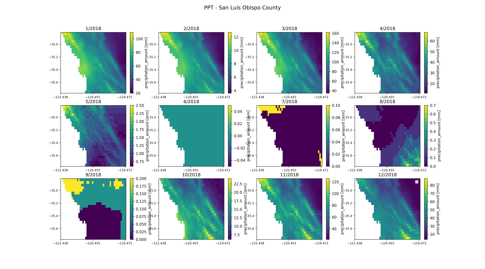
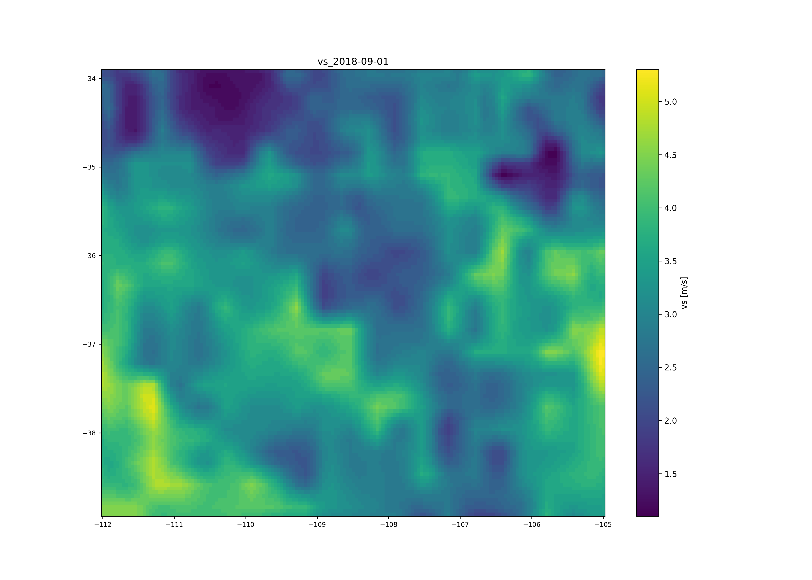

# [**climatePy**](https://github.com/anguswg-ucsb/climatePy)

<!-- badges: start -->

[](#)
[](#)
[](https://choosealicense.com/licenses/mit/)

<!-- badges: end -->

## Description

A Python 📦 for getting point and gridded climate data by AOI. `climatePy` is the Python version of the [`climateR`](https://github.com/mikejohnson51/climateR) R package, providing all of the same functionality but in Python.

As its stated in the [climateR README](https://github.com/mikejohnson51/climateR#climater):
climatePy simplifies the steps needed to get climate data into Python. At its core it provides three main things:

1. A climate catalog of over 100,000k datasets from over 2,000 data providers/archives. See (`data_catalog()`)

2. A general toolkit for accessing remote and local gridded data files bounded by space, time, and variable constraints (`dap()`, `dap_crop()`, `read_dap_file()`)

3. A set of shortcuts that implement these methods for a core set of selected catalog elements

<br>

## Links

- [climatePy (Lynker intel)](https://github.com/LynkerIntel/climatePy)
- [climatePy PyPI](https://pypi.org/project/climatePy/)
- [**climateR/climatePy slideshow**](https://mikejohnson51.github.io/climateR-intro/#1)

<br>

## Table of Contents

- [Installation](#installation)
- [Usage](#usage)
- [Credits](#credits)
- [License](#license)
- [How to Contribute](#how-to-contribute)

<br>

## Installation

`climatePy` can be downloaded from PyPI via `pip` like so:

```
pip install climatePy
```

**Note:** climatePy is still in **development**

<br>

## Usage

### Loading climate catalog

```python
import climatePy
import geopandas as gpd
import matplotlib.pyplot as plt

# load climate catalog
catalog = climatePy.data_catalog()

# load example AOI data
AOI = gpd.read_file('src/data/san_luis_obispo_county.gpkg')
```

<br>

### Using `climatepy_filter()`:

The `climatepy_filter()` is one of the core functions of `climatePy` and is used to do the first round of filtering on the base climate catalog.

Here we filter down our climate catalog to TerraClim precipitation data for San Luis Obispo County, CA.

```python
# collect raw meta data
raw = climatePy.climatepy_filter(
        id        = "terraclim",
        AOI       = AOI,
        varname   = "ppt"
        )
```

| id      | asset                                       | varname |
| ------- | ------------------------------------------- | ------- |
| gridmet | agg_terraclimate_ppt_1958_CurrentYear_GLOBE | ppt     |

### AOI



<br>

### Getting climate data in AOI

Now lets use the `getTerraClim()` function from `climatePy` to get precipitation data for January 1st, 2018 in San Luis Obispo County, CA.

```python
# collect raw meta data
prcp = climatePy.getTerraClim(
    AOI       = AOI,
    varname   = "ppt",
    startDate = "2018-01-01",
    endDate   = "2018-01-01"
    )
```



<br>
<br>

### Get data within a date range

We can also get data within a date range. we'll use `getTerraClim()` to get monthly precipitation data for all of 2018 in San Luis Obispo County, CA.

```python
# collect raw meta data
prcp = climatePy.getTerraClim(
    AOI       = AOI,
    varname   = "ppt",
    startDate = "2018-01-01",
    endDate   = "2018-12-01"
    )
```



<br>

### Data from known bounding coordinates

`climatePy` offers support for `shapely` bounding boxes. Here we are requesting wind velocity data for the four corners region of the USA by bounding coordinates.

```python
from shapely.geometry import box

bbox = box(-112, 34, -105, 39)

bbox = gpd.GeoDataFrame(geometry=[bbox], crs ='EPSG:4326')

vs = climatePy.getGridMET(
       AOI       = bbox,
       varname   = "vs",
       startDate = "2018-09-01"
       )
```



<br>
<br>

## Credits

Credit to [Mike J Johnson](https://github.com/mikejohnson51) and the other contributors to the original [`climateR`](https://github.com/mikejohnson51/climateR) package listed below:

- [Justin Singh](https://github.com/program--)
- [Max Joseph](https://github.com/mbjoseph)
- [Eric R. Scott](https://github.com/Aariq)
- [James Tsakalos](https://github.com/jamestsakalos)

<br>

## License

GNU General Public License v3.0

climatePy: Find, subset and retrieve climate and geospatial data by AOI in Python.
Copyright (C) 2023 Angus Watters, Mike J. Johnson

This program is free software: you can redistribute it and/or modify
it under the terms of the GNU General Public License as published by
the Free Software Foundation, either version 3 of the License, or
(at your option) any later version.

This program is distributed in the hope that it will be useful,
but WITHOUT ANY WARRANTY; without even the implied warranty of
MERCHANTABILITY or FITNESS FOR A PARTICULAR PURPOSE. See the
GNU General Public License for more details.

You should have received a copy of the GNU General Public License
along with this program. If not, see <https://www.gnu.org/licenses/>.

---

<br>

## How to Contribute

If you would like to contribute, submit a PR and we will get to as soon as we can!
If you have any issues please open an issue on GitHub. For any questions, feel free to ask [@anguswg-ucsb](https://github.com/anguswg-ucsb) or [@mikejohnson51](https://github.com/mikejohnson51), or simply create an issue on GitHub.
