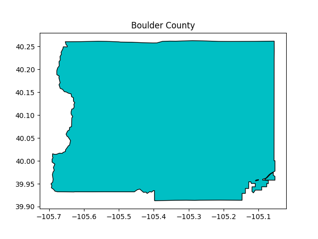

# **climatePy**

<!-- badges: start -->

[](#)
[](https://choosealicense.com/licenses/mit/)
<!-- badges: end -->

<div align="left">

<p align="left">
<a href="https://mikejohnson51.github.io/climateR-intro/#1"><strong> climateR </strong></a>
<br /> 
</p>

</div>

<hr>

A Python 📦 for getting point and gridded climate data by AOI. `climatePy` is the Python version of the [`climateR`](https://github.com/mikejohnson51/climateR) R package, providing all of the same functionality but in Python.

As its stated in the [climateR README](https://github.com/mikejohnson51/climateR#climater):
climatePy simplifies the steps needed to get climate data into Python. At its core it provides three main things:

1. A climate catalog of over 100,000k datasets from over 2,000 data providers/archives. See (climatePy.load_data)

2. A general toolkit for accessing remote and local gridded data files bounded by space, time, and variable constraints (dap, dap_crop, read_dap_file)

3. A set of shortcuts that implement these methods for a core set of selected catalog elements

<br>

> See [**`climateR`**](https://github.com/mikejohnson51/climateR), for the **R** version of `climatePy` 

---

- [**climateR slideshow**](https://mikejohnson51.github.io/climateR-intro/#1)

---

<br> 

## **Installation**
`climatePy` is still in the development phase and is not yet ready for external users, but eventually it will be installable from PyPI like so:

``` 
pip install climatePy
```

<br>

## Loading climate catalog

```python
import geopandas as gpd
import matplotlib.pyplot as plt
from src.climatePy import load_data

# load climate catalog
catalog = load_data()

# load example AOI data
AOI = gpd.read_file('src/data/boulder_county.gpkg')
```


<br>

## Using `climatepy_filter()`:

The `climatepy_filter()` is one of the core functions of `climatePy` and is used to do the first round of filtering on the base climate catalog.

Here we filter down our climate catalog to gridMET precipitation data for Boulder County, CO.

```python
# collect raw meta data
raw = climatepy_filter.climatepy_filter(
        id        = "gridmet", 
        AOI       = AOI, 
        varname   = "pr"
        )
```

| id  | asset | varname    |
|-------|-----|---------|
| gridmet | agg_met_pr_1979_CurrentYear_CONUS  | precipitation_amount   |

### AOI



